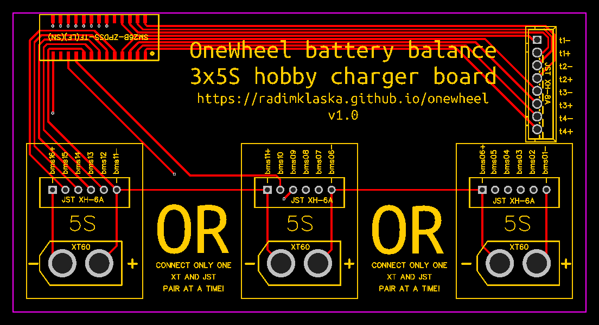
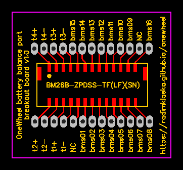
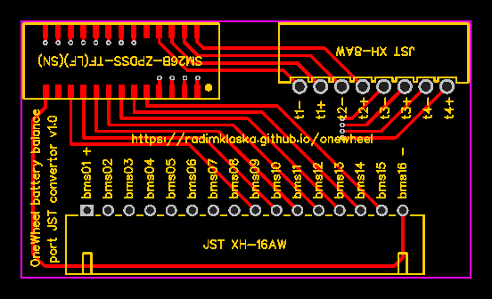

# PCBs for OneWheel

You can order these on https://cart.jlcpcb.com/quote by uploading the whole `*.zip` file for each project.

# 3x5S charge board

Manage your OneWheel battery with a hobby charger. These usually do 6S or 8S max. This board will allow you split up the balance connector to standard 3 5S parts.

This is helpful when diagnosing a battery health and balancing the pack.

## BOM
* 1x `SM26B-ZPDSS-TF(LF)(SN)`
  * this is the same connector as on OneWheel BMS, but side entry version
  * [https://www.digikey.com/en/products/detail/SM26B-ZPDSS-TF(LF)(SN)/455-2559-1-ND/2472615?itemSeq=361766693](https://www.digikey.com/en/products/detail/SM26B-ZPDSS-TF(LF)(SN)/455-2559-1-ND/2472615?itemSeq=361766693)
* 3x `JST XH-6A`
  * Standard 5S balance connector.
  * [https://lcsc.com/product-detail/Wire-To-Board-Wire-To-Wire-Connector_CAX-XH-6A_C722879.html](https://lcsc.com/product-detail/Wire-To-Board-Wire-To-Wire-Connector_CAX-XH-6A_C722879.html)
* 3x `XT60`
* 1x `JST XH-8A`
  * Optional.
  * Exposes OneWheel battery thermistors.
  * [https://lcsc.com/product-detail/Wire-To-Board-Wire-To-Wire-Connector_CAX-XH-8A_C722885.html](https://lcsc.com/product-detail/Wire-To-Board-Wire-To-Wire-Connector_CAX-XH-8A_C722885.html)

## Revisions
* v1.1
  * Fixed XT60 polarity.
* v1.0
  * Initial revision.

# Balance breakout

Simple breakout board for balance port on OneWheel batteries.

## BOM
* 1x `BM26B-ZPDSS-TF(LF)(SN)`
  * BMS Connector (PCB Side)
  * [https://www.digikey.com/product-detail/en/jst-sales-america-inc/BM26B-ZPDSS-TF(LF)(SN)/455-2548-6-ND/2472626](https://www.digikey.com/product-detail/en/jst-sales-america-inc/BM26B-ZPDSS-TF(LF)(SN)/455-2548-6-ND/2472626)

## Revisions
* v1.1
  * marked positive and negative pads
  * thicker paths
  * better path separation
  * slightly bigger PCB
* v1.0
  * Initial revision.

# 15S JST

Conversion from OneWheel battery balance connector to standard 15S JST connector.

## OneWheel - Battery Pack schematics
Overview, BMS connector (battery pack side), XT-60 connector, and Pint/XR+ battery pack layouts.
https://imgur.com/a/Sif7Wlo
Note : Each pack has 4 10k NTC Thermistors placed in-between cells for temperature monitoring.

=============== Part Number / Links Below ===============
XR+ Batteries : https://www.imrbatteries.com/samsung-30q-18650-3000mah-15a-battery/
Pint Batteries : https://www.imrbatteries.com/sony-vtc5d-18650-2600mah-25a-battery/
BMS Connector (PCB Side) : https://www.digikey.com/product-detail/en/jst-sales-america-inc/BM26B-ZPDSS-TF(LF)(SN)/455-2548-6-ND/2472626
BMS Connector (Battery Pack) : https://www.digikey.com/product-detail/en/jst-sales-america-inc/ZPDR-26V-S/455-2536-ND/2472569
BMS Connector Pins : https://www.digikey.com/product-detail/en/jst-sales-america-inc/SZPD-002T-P0.3/455-2539-1-ND/2472595
10k NTC Thermistors : https://www.digikey.com/catalog/en/partgroup/ntcle413/11021

## BOM
* 1x `SM26B-ZPDSS-TF(LF)(SN)`
  * this is the same connector as on OneWheel BMS, but side entry version
  * [https://www.digikey.com/en/products/detail/SM26B-ZPDSS-TF(LF)(SN)/455-2559-1-ND/2472615?itemSeq=361766693](https://www.digikey.com/en/products/detail/SM26B-ZPDSS-TF(LF)(SN)/455-2559-1-ND/2472615?itemSeq=361766693)
* 1x `JST XH-8AW`
  * Standard balance connector, side entry, latch on top
  * [https://lcsc.com/product-detail/Wire-To-Board-Wire-To-Wire-Connector_CAX-XH-8AW_C722888.html](https://lcsc.com/product-detail/Wire-To-Board-Wire-To-Wire-Connector_CAX-XH-8AW_C722888.html)
* 1x `JST XH-16AW`
  * 15S balance connector, side entry, latch on top
  * [https://lcsc.com/product-detail/Wire-To-Board-Wire-To-Wire-Connector_BOOMELE-Boom-Precision-Elec-XH-6AW_C146117.html](https://lcsc.com/product-detail/Wire-To-Board-Wire-To-Wire-Connector_BOOMELE-Boom-Precision-Elec-XH-6AW_C146117.html)

## Revisions
* v1.0
  * Initial revision.
